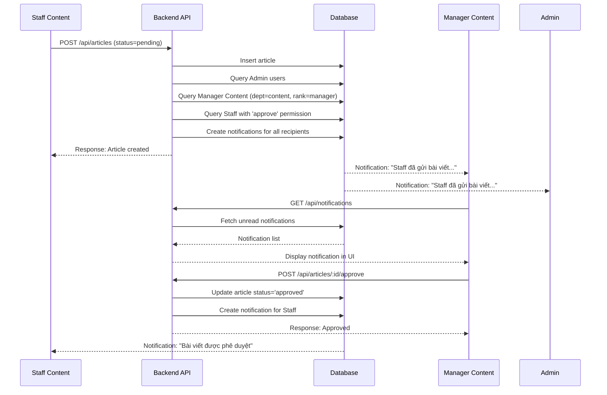

# 🎯 PHÂN QUYỀN MANAGER CONTENT - SUMMARY IMPLEMENTATION

## 📌 **TÓM TẮT VẤN ĐỀ**

### Vấn đề ban đầu:
- Manager Content được giao quyền `approve` trong UI Staff Management
- **NHƯNG** thực tế:
  - ❌ Manager Content KHÔNG nhận notification khi Staff gửi bài viết
  - ❌ Manager Content KHÔNG có nút "Duyệt" trong UI
  - ❌ Manager Content vẫn hoạt động như Staff thường

### Nguyên nhân gốc rễ:
**Hệ thống phân quyền 2 tầng không đồng bộ:**

1. **Tầng 1 (Hardcode):** ✅ Đã có
   - File: `server/middleware/roleMiddleware.js`
   - Logic: `if (department === 'content' && rank === 'manager') → full access`
   - Tác dụng: Manager Content gọi được API routes
   - Phạm vi: **Chỉ backend**

2. **Tầng 2 (Database):** ❌ THIẾU
   - Table: `staff.permissions` column
   - Format: `{articles: ['view', 'create', 'approve', ...]}`
   - Tác dụng: Frontend kiểm tra quyền, gửi notifications
   - Phạm vi: **Frontend + Notification system**
   - **VẤN ĐỀ:** Manager Content chưa có permissions trong DB → Frontend check thất bại

---

## ✅ **GIẢI PHÁP ĐÃ IMPLEMENT**

### 1. **Cấp quyền Database cho Manager Content**

**File:** `server/scripts/fix-manager-content-permissions.sql`

**Chức năng:**
- Grant TẤT CẢ 13 permissions cho Manager Content:
  ```json
  {
    "articles": [
      "view", "create", "approve",
      "create_medicine", "edit_medicine", "hide_medicine", "delete_medicine",
      "create_disease", "edit_disease", "hide_disease", "delete_disease",
      "review_suggestion", "view_suggestion"
    ]
  }
  ```

**Cách chạy:**
```bash
mysql -u root -p clinic_system < server/scripts/fix-manager-content-permissions.sql
```

**Kết quả mong đợi:**
- Manager Content có đầy đủ permissions trong database
- Sau logout/login → localStorage chứa permissions đầy đủ
- Frontend permission checks pass

---

### 2. **Update Notification System**

**File:** `server/controllers/articleController.js`

#### 2.1. Tạo hàm mới `notifyManagersAndAdmins()`

**Location:** Line 145-220

**Logic:**
```javascript
const notifyManagersAndAdmins = async (type, message, link) => {
  // 1. Tìm tất cả admin
  const admins = await User.findAll({ where: { role: 'admin' } });
  
  // 2. Tìm Manager Content (department='content', rank='manager')
  const managers = await Staff.findAll({
    where: { department: 'content', rank: 'manager' },
    include: [{ model: User, as: 'user' }]
  });
  
  // 3. Tìm staff có quyền 'approve' trong articles permissions
  const staffWithApprove = await Staff.findAll({
    // Filter: permissions.articles includes 'approve'
  });
  
  // 4. Gửi notification cho tất cả (dùng Set để tránh duplicate)
  for (const userId of recipientIds) {
    await createNotification(userId, type, message, link);
  }
};
```

**Tác dụng:**
- Gửi notification đến 3 nhóm:
  1. Admin (role='admin')
  2. Manager Content (department='content', rank='manager')
  3. Staff khác có quyền 'approve'

#### 2.2. Replace 3 chỗ gọi `notifyAllAdmins()`

| Location | Context | Updated to |
|----------|---------|------------|
| Line ~936 | Staff tạo bài viết mới | `notifyManagersAndAdmins()` |
| Line ~1086 | Staff gửi lại bài viết sau chỉnh sửa | `notifyManagersAndAdmins()` |
| Line ~1605 | Staff resubmit bài viết | `notifyManagersAndAdmins()` |

**GIỮ NGUYÊN `notifyAllAdmins()`** ở các chỗ:
- Line ~1742: Báo cáo bài viết vi phạm (chỉ admin xử lý)
- Line ~1933: Comment trong bài viết review (chỉ admin xử lý)

---

### 3. **Test & Verification Tools**

**File:** `server/scripts/test-notification-system.sql`

**Chức năng:**
- **STEP 1:** Kiểm tra Manager Content tồn tại trong DB
- **STEP 2:** Kiểm tra notifications gần đây cho Manager
- **STEP 3:** So sánh notification count: Admin vs Manager Content
- **STEP 4:** List tất cả staff có quyền 'approve'
- **STEP 5:** Thống kê notifications trong 24h
- **STEP 6:** Insert test notification thủ công (optional)

**Cách sử dụng:**
```bash
mysql -u root -p clinic_system < server/scripts/test-notification-system.sql
```

**Kết quả mong đợi:**
- STEP 1: Tìm thấy ≥1 Manager Content
- STEP 2: Có notifications nếu vừa test
- STEP 3: Admin và Manager Content đều có số lượng notifications tương đương
- STEP 4: Manager Content xuất hiện trong list

---

### 4. **Testing Guide**

**File:** `server/TESTING_GUIDE_MANAGER_PERMISSIONS.md`

**Nội dung:** 300+ dòng hướng dẫn test toàn diện

**Cấu trúc:**
- **PHASE 1:** Chuẩn bị Database (chạy SQL scripts)
- **PHASE 2:** Chuẩn bị Backend (verify code, restart server)
- **PHASE 3:** Test Frontend UI (login, check localStorage)
- **PHASE 4:** Test Workflow (tạo bài viết, phê duyệt)
- **PHASE 5:** Test Permission Restrictions (negative tests)
- **TROUBLESHOOTING:** 4 common issues + solutions
- **SUCCESS CRITERIA:** 8 checkpoints

---

## 🔄 **WORKFLOW HOÀN CHỈNH**

### Scenario: Staff Content gửi bài viết chờ phê duyệt



---

## 📊 **MATRIX PHÂN QUYỀN**

| Chức năng | Admin | Manager Content | Staff Content |
|-----------|-------|-----------------|---------------|
| **Xem bài viết** |
| - Bài viết của mình | ✅ | ✅ | ✅ |
| - Bài viết của người khác | ✅ | ✅ | ❌ |
| **Tạo bài viết** | ✅ | ✅ | ✅ |
| **Phê duyệt bài viết** | ✅ | ✅ | ❌ |
| **Từ chối bài viết** | ✅ | ✅ | ❌ |
| **Nhận notification bài pending** | ✅ | ✅ | ❌ |
| **Thuốc/Bệnh lý** |
| - Tạo trực tiếp (không qua suggestion) | ✅ | ✅ | ❌ |
| - Đề xuất (qua entity_suggestions) | ✅ | ✅ | ✅ |
| - Duyệt đề xuất | ✅ | ✅ | ❌ |
| - Ẩn/Hiện | ✅ | ✅ | ❌ |
| - Xóa | ✅ | ✅ | ❌ |
| **UI Elements** |
| - Nút "Duyệt" | ✅ | ✅ | ❌ |
| - Tab "Chờ phê duyệt" | ✅ | ✅ | ❌ |
| - Tab "Quản lý thuốc" | ✅ | ✅ | ⚠️ (readonly) |

---

## 🔍 **KIỂM TRA NHANH**

### 1. Verify Code Changes:
```bash
# Check roleMiddleware.js
grep -A 5 "Manager Content" server/middleware/roleMiddleware.js

# Check notifyManagersAndAdmins function
grep -n "notifyManagersAndAdmins" server/controllers/articleController.js

# Expected: Line ~145 (definition), ~936, ~1086, ~1605 (calls)
```

### 2. Verify Database:
```sql
-- Check Manager Content permissions
SELECT 
    u.email, 
    s.department, 
    s.rank, 
    s.permissions 
FROM users u
JOIN staff s ON u.id = s.user_id
WHERE s.department = 'content' AND s.rank = 'manager';

-- Expected: permissions JSON có 13 items trong articles array
```

### 3. Verify Frontend:
```javascript
// DevTools Console (sau khi login Manager Content)
const user = JSON.parse(localStorage.getItem('user'));
console.log(user.staff.permissions.articles);

// Expected: Array[13] với 'approve' ở trong đó
```

---

## 🐛 **KNOWN ISSUES & SOLUTIONS**

### Issue 1: "Cannot read properties of null (reading 'model')"
**Status:** ✅ FIXED  
**File:** `client/src/pages/ArticleManagementPage.js`  
**Solution:** Added 3 null checks:
- Line ~298: Check `editor.plugins` exists
- Line ~2330: Check `editor.ui.view.toolbar` exists
- Line ~2327: Conditional render `{DecoupledEditor ? <CKEditor /> : Loading}`

### Issue 2: Medicine/Disease suggestion routes crash server
**Status:** ⚠️ TEMPORARILY FIXED  
**File:** `server/routes/articleRoutes.js`  
**Solution:** Commented out 6 routes (line ~115-143)  
**TODO:** Implement controller functions, then uncomment

### Issue 3: Manager Content không nhận notification
**Status:** ✅ FIXED  
**Root Cause:** Chỉ gọi `notifyAllAdmins()` (only admin)  
**Solution:** Tạo `notifyManagersAndAdmins()`, replace 3 calls

### Issue 4: Manager Content permissions rỗng trong localStorage
**Status:** ✅ FIXED  
**Root Cause:** Database chưa có permissions  
**Solution:** Chạy `fix-manager-content-permissions.sql`, logout/login

---

## 📝 **TESTING CHECKLIST**

```
BEFORE TESTING:
☐ Run fix-manager-content-permissions.sql
☐ Run test-notification-system.sql (verify setup)
☐ Restart server
☐ Clear browser cache + localStorage
☐ Read TESTING_GUIDE_MANAGER_PERMISSIONS.md

PHASE 1 - Database:
☐ Manager Content tồn tại trong DB
☐ Manager Content có 13 permissions
☐ Manager Content có quyền 'approve'

PHASE 2 - Backend:
☐ roleMiddleware.js có Manager Content logic
☐ notifyManagersAndAdmins() function tồn tại
☐ 3 calls đã replace từ notifyAllAdmins
☐ Server start không lỗi

PHASE 3 - Frontend:
☐ Manager Content login thành công
☐ localStorage chứa permissions đầy đủ
☐ Không bị redirect về /404
☐ Sidebar hiển thị "Quản lý bài viết"

PHASE 4 - Workflow:
☐ Staff tạo bài viết → status='pending'
☐ Manager nhận notification
☐ Manager thấy nút "Duyệt"
☐ Manager duyệt thành công
☐ Staff nhận notification approved

PHASE 5 - Restrictions:
☐ Staff thường KHÔNG thấy nút "Duyệt"
☐ Staff thường chỉ thấy bài viết của mình
☐ Manager thấy TẤT CẢ bài viết
☐ Manager tạo medicine/disease trực tiếp (không qua suggestions)
```

---

## 🎯 **EXPECTED FINAL STATE**

### Backend Console Logs:
```
✓ Đã tạo thông báo cho user 5 (Admin)
✓ Đã tạo thông báo cho user 8 (Manager Content)
✓ Đã gửi thông báo tới 2 người (admin + managers với quyền approve)
```

### Database State:
```sql
-- notifications table
+----+---------+----------+--------------------------------------------+
| id | user_id | type     | message                                    |
+----+---------+----------+--------------------------------------------+
| 42 | 5       | article  | Nguyễn Văn A đã gửi bài viết "..." phê...  |
| 43 | 8       | article  | Nguyễn Văn A đã gửi bài viết "..." phê...  |
+----+---------+----------+--------------------------------------------+

-- staff.permissions for Manager Content
{
  "articles": [
    "view", "create", "approve", "create_medicine", "create_disease",
    "edit_medicine", "edit_disease", "hide_medicine", "hide_disease",
    "delete_medicine", "delete_disease", "review_suggestion", "view_suggestion"
  ]
}
```

### Frontend UI:
```
Manager Content Dashboard:
┌─────────────────────────────────────┐
│ 🔔 (2)  ← Notification badge        │
│                                     │
│ Sidebar:                            │
│ ✓ Quản lý bài viết (visible)       │
│                                     │
│ Article Management Page:            │
│ ✓ Tab "Chờ phê duyệt" (visible)   │
│ ✓ Button "Duyệt" (visible)         │
│ ✓ Button "Từ chối" (visible)       │
│ ✓ List TẤT CẢ articles             │
└─────────────────────────────────────┘
```

---

## 📚 **FILES REFERENCE**

### Modified Files:
1. `server/middleware/roleMiddleware.js` (Line ~195)
2. `server/controllers/articleController.js` (Line ~145, ~936, ~1086, ~1605)
3. `client/src/pages/ArticleManagementPage.js` (Line ~298, ~2327, ~2330)
4. `client/src/hooks/usePermissions.js` (Enhanced error handling)

### New Files:
1. `server/scripts/fix-manager-content-permissions.sql` (60 lines)
2. `server/scripts/test-notification-system.sql` (200 lines)
3. `server/TESTING_GUIDE_MANAGER_PERMISSIONS.md` (400+ lines)
4. `server/MANAGER_CONTENT_PERMISSIONS_SUMMARY.md` (this file)

### Documentation Files (Previous):
1. `server/ARTICLE_PERMISSIONS_UPDATE.md`
2. `server/TROUBLESHOOTING_ARTICLE_PERMISSIONS.md`

---

## 🚀 **DEPLOYMENT CHECKLIST**

```
PRODUCTION DEPLOYMENT:

1. Database Migration:
   ☐ Backup database trước
   ☐ Run fix-manager-content-permissions.sql
   ☐ Verify permissions đã update

2. Code Deployment:
   ☐ Pull latest code
   ☐ Verify all files committed
   ☐ npm install (if dependencies changed)
   ☐ Restart server

3. Testing:
   ☐ Login Manager Content
   ☐ Test workflow đầy đủ
   ☐ Check notifications hoạt động
   ☐ Verify permissions không bị reset sau restart

4. Monitoring:
   ☐ Check server logs
   ☐ Monitor notification creation
   ☐ Track approval workflow success rate

5. Rollback Plan:
   ☐ Keep backup database
   ☐ Keep previous code version
   ☐ Document rollback steps
```

---

## 📞 **SUPPORT**

Nếu gặp vấn đề, check theo thứ tự:

1. **Read TESTING_GUIDE_MANAGER_PERMISSIONS.md** - Có troubleshooting chi tiết
2. **Run test-notification-system.sql** - Xác định vấn đề ở đâu
3. **Check server logs** - Tìm error messages
4. **Verify database permissions** - Đảm bảo SQL script đã chạy
5. **Clear cache + logout/login** - Refresh localStorage

---

**Document Version:** 1.0  
**Created:** 2025-01-XX  
**Last Updated:** 2025-01-XX  
**Status:** ✅ Implementation Complete - Ready for Testing
